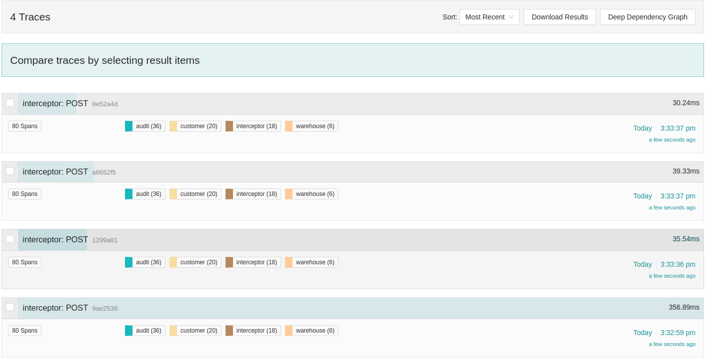
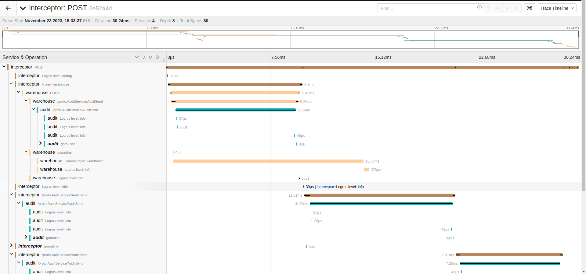

# Microservice Demo

This work uses for demonstrate functionality of https://github.com/dangbb/opentelemetry-go-instrumentation.

## Start service command

```shell
cd docker/infra

\\ remove path at VOLUME_FOLDER in .env using rm -rf 

docker-compose -f docker-compose-infra.yml up -d

cd ../..
make build 
```

Open four terminal, for each, run one of these commands:

```shell
make run-warehouse
make run-customer
make run-interceptor
make run-audit
```

Check by run this request:

```shell
curl --location 'http://localhost:8090/send-package' \
--header 'Content-Type: application/json' \
--data '{
    "location": "144 Xuân Thủy, Dịch Vọng Hậu, Cầu Giấy, Hà Nội",
    "name": "UET-VNU"
}'
```

If response message is `OK` then setup is ok.

## Auto instrumentation integration commands

```shell
export CGO_ENABLED=1;
export OTEL_EXPORTER_OTLP_ENDPOINT=http://localhost:4317;
export OTEL_GO_AUTO_INCLUDE_DB_STATEMENT=true;
export OTEL_PROPAGATORS=tracecontext,baggage;
export QUEUE_DELAY_DURATION=200ms;
export REDIS_ADDRESS=localhost:6379;
export REDIS_PASSWORD=
```

_Change value of `/home/dangbb/dangnh-opentelemetry-go-instrumentation/main` to corresponding address of automatic instrumentation tool. Should point to the binary file build from https://github.com/dangbb/opentelemetry-go-instrumentation._

Audit Service

```shell
export OTEL_GO_AUTO_TARGET_EXE=/home/dangbb/auto-instrumentation-thesis-demo/bin/audit;
export OTEL_SERVICE_NAME=audit;
sudo -E /home/dangbb/dangnh-opentelemetry-go-instrumentation/main
```

Customer

```shell
export OTEL_GO_AUTO_TARGET_EXE=/home/dangbb/auto-instrumentation-thesis-demo/bin/customer;
export OTEL_SERVICE_NAME=customer;
sudo -E /home/dangbb/dangnh-opentelemetry-go-instrumentation/main
```

Interceptor

```shell
export OTEL_GO_AUTO_TARGET_EXE=/home/dangbb/auto-instrumentation-thesis-demo/bin/interceptor;
export OTEL_SERVICE_NAME=interceptor;
sudo -E /home/dangbb/dangnh-opentelemetry-go-instrumentation/main
```

Warehouse

```shell
export OTEL_GO_AUTO_TARGET_EXE=/home/dangbb/auto-instrumentation-thesis-demo/bin/warehouse;
export OTEL_SERVICE_NAME=warehouse;
sudo -E /home/dangbb/dangnh-opentelemetry-go-instrumentation/main
```

## Demo result

Expected trace visualize in Jaeger:



Trace detail in Jaeger:

